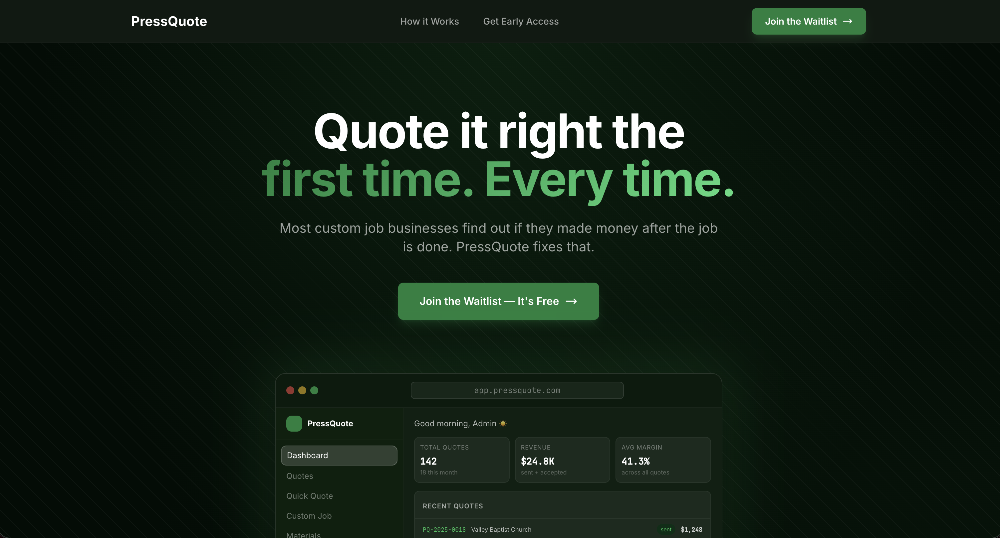

# PressQuote

PressQuote is a quoting tool built for print shops and custom job businesses. Most print shops price jobs on gut feel, old spreadsheets, or whatever they charged last time — and don't find out if a job was profitable until the work is already done and the invoice is sent.

PressQuote connects directly to QuickBooks and pulls real numbers — materials, labor, overhead, vendor costs — so when you build a quote, you can see your actual margin before it ever goes out. No spreadsheets, no guessing, no surprises after the fact.

This repo is the marketing/waitlist site for PressQuote.

---

## Tech Stack

- **[Next.js 14](https://nextjs.org/)** — App Router, server components, file-based routing
- **[Tailwind CSS](https://tailwindcss.com/)** — utility-first styling
- **[Resend](https://resend.com/)** — transactional email for waitlist confirmations and signup notifications
- **[Google Fonts](https://fonts.google.com/)** — Inter
- **[Vercel](https://vercel.com/)** — hosting and deployment

---

## File Structure

```
pressquotesite/
├── app/
│   ├── layout.jsx              ← SEO metadata, fonts, root HTML
│   ├── page.jsx                ← All landing page content
│   ├── globals.css             ← Global styles + Tailwind
│   └── api/
│       └── waitlist/
│           └── route.js        ← Waitlist API route (Resend)
├── components/
│   ├── WaitlistForm.jsx        ← Email capture form (client component)
│   └── DashboardMockup.jsx     ← App preview shown in hero
├── package.json
├── next.config.js
├── tailwind.config.js
└── postcss.config.js
```

## Deployment

Hosted on Vercel. Every push to `main` auto-deploys.

Website link: https://pressquote.net/


